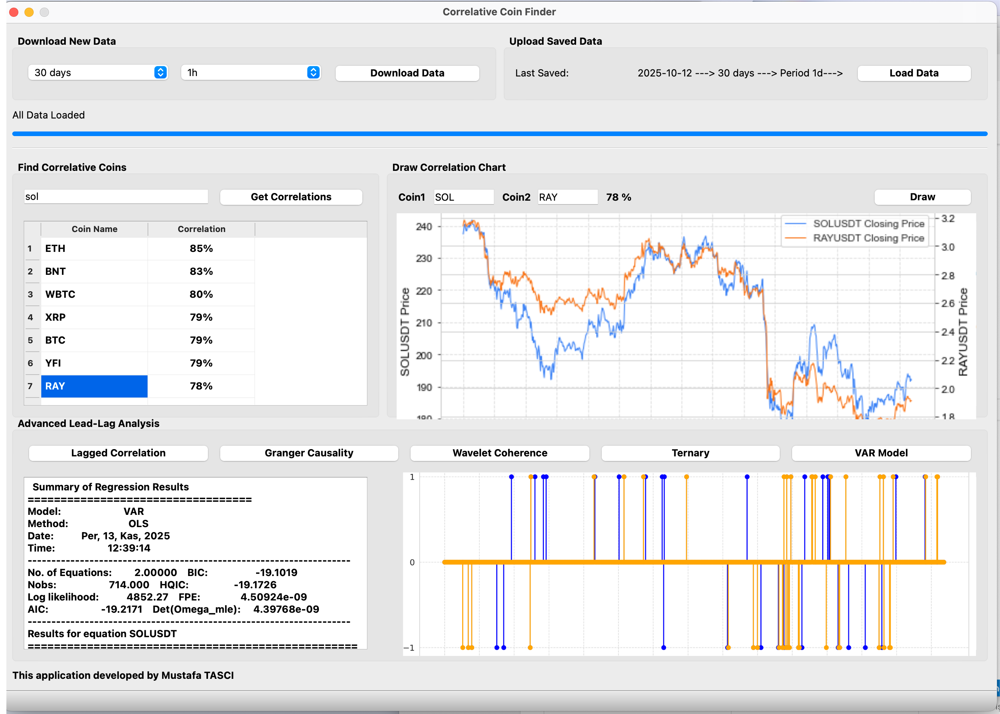

# TAM: Ternary Agreement Model for Cryptocurrency Lead-Lag Analysis

[](https://opensource.org/licenses/MIT)
[](https://www.python.org/downloads/)
This repository contains the official source code, datasets, and supplementary tools for the research paper: **"Quantifying Lead-Lag Relationships in Cryptocurrency Markets using the Ternary Agreement Model (TAM)."**

## 📌 Overview

The **Ternary Agreement Model (TAM)** is a novel econometric framework designed to quantify lead-lag dynamics and structural dependencies in financial markets. Unlike traditional correlation analyses, TAM categorizes price movements into a ternary state space (Positive, Neutral, Negative) to detect:
- **Technological Dependencies** (e.g., L1 vs. L2 scaling solutions).
- **Sectoral Contagion** (e.g., Meme coin hype cycles).
- **Information Flow Direction** (Leader-Follower identification).

This repository provides both the analytical notebooks used for the paper and a desktop application for real-time monitoring.

## 📂 Repository Structure

- **`ternarylag.ipynb`**: The core Jupyter Notebook containing the TAM algorithm, data fetching methodology (via Binance API), statistical tests, and visualization code used in the manuscript.
- **`coin3.py`**: A desktop application (GUI) developed to visualize TAM signals and monitor coin pairs in real-time.
- **`data/`**: Contains the generated CSV files and intermediate datasets used in the analysis.
- **`requirements.txt`**: List of Python dependencies required to reproduce the study.

## 📸 Desktop Application (`coin3.py`)

The repository includes a standalone Python desktop tool for researchers and traders to visualize live lead-lag signals.


*(Figure: Interface of the TAM Real-time Monitor showing lead-lag interactions.)*

## 🚀 Installation & Usage

### Prerequisites
Ensure you have Python 3.8+ installed.

1. **Clone the repository:**
   ```bash
   git clone [https://github.com/mtasci42/TAM-Ternary-Agreement-Model-.git](https://github.com/mtasci42/TAM-Ternary-Agreement-Model-.git)
   cd TAM-Ternary-Agreement-Model-
Elbette, README dosyanızın eksik kalan kısmını (Dependencies'den sonrasını) aşağıda paylaşıyorum. Bunu kopyalayıp mevcut dosyanızın sonuna ekleyebilirsiniz.


2. **Install dependencies:**
   ```bash
   pip install -r requirements.txt


*Key libraries: `pandas`, `numpy`, `python-binance`, `matplotlib`, `seaborn`, `scipy`.*

### Running the Analysis

To reproduce the paper's results:

1.  Open `ternarylag.ipynb` in Jupyter Notebook or JupyterLab.
2.  Run all cells sequentially.
    *Note: The notebook fetches historical data from the Binance Public API. Ensure you have an active internet connection.*

### Running the Desktop App

To launch the real-time monitoring tool:

```bash
python coin3.py
```

## 📊 Data Availability

The raw market data (OHLC) used in this study is sourced from the **Binance Public API**. The scripts included in this repository demonstrate how to programmatically fetch, clean, and process this data for the TAM framework.

## 📝 Citation

If you use this code or model in your research, please cite the accompanying paper (and this repository):

```bibtex
@misc{tasci2025tam,
  author = {Tasci, M.},
  title = {TAM (Ternary Agreement Model): Source code for Lead-Lag Analysis},
  year = {2025},
  publisher = {GitHub},
  journal = {GitHub repository},
  howpublished = {\url{[https://github.com/mtasci42/TAM-Ternary-Agreement-Model-](https://github.com/mtasci42/TAM-Ternary-Agreement-Model-)}}
}
```

## 🤝 Contributing

Contributions, issues, and feature requests are welcome. Feel free to check the [issues page](https://www.google.com/search?q=https://github.com/mtasci42/TAM-Ternary-Agreement-Model-/issues).

## 📜 License

This project is licensed under the MIT License - see the [LICENSE](https://www.google.com/search?q=LICENSE) file for details.
